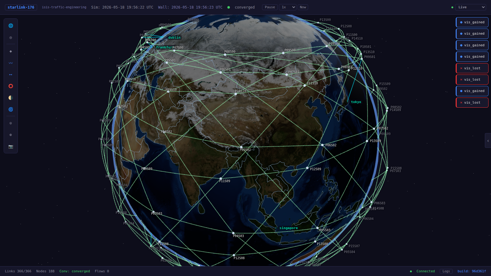
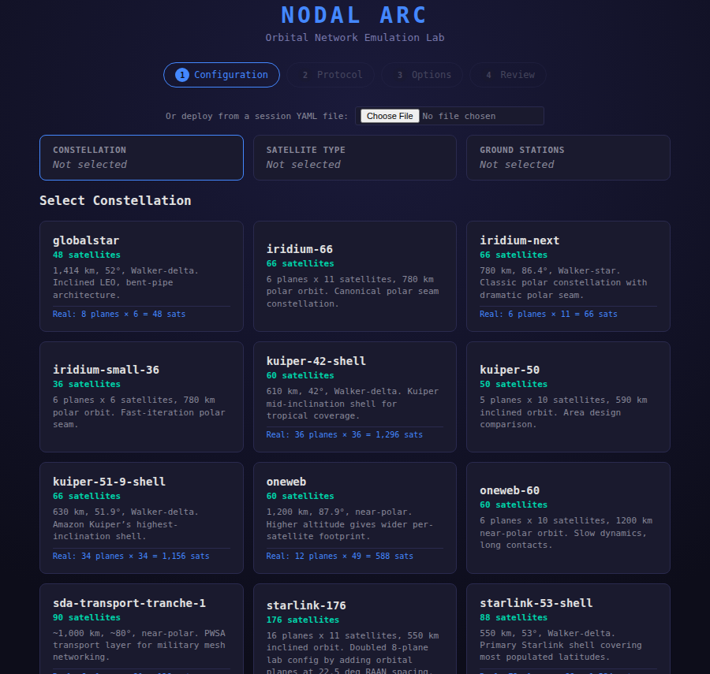
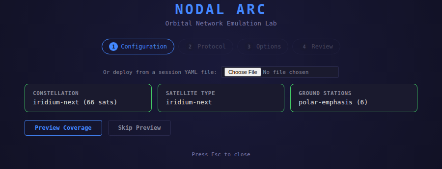
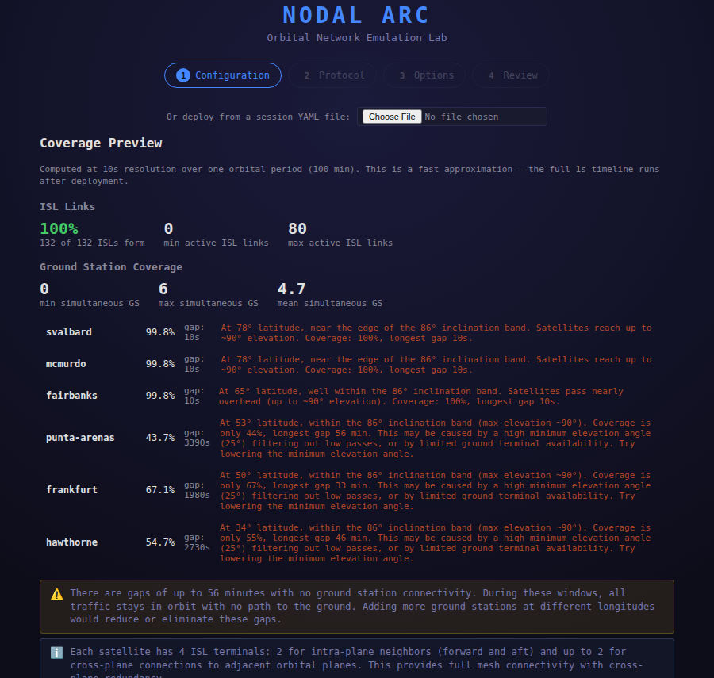
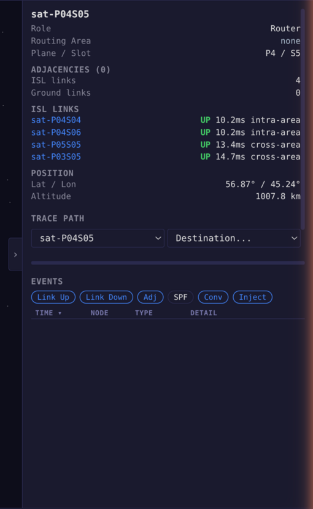
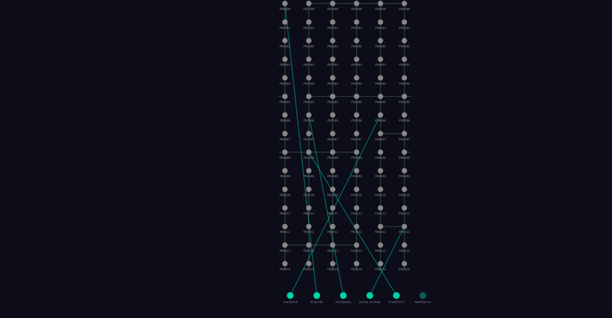
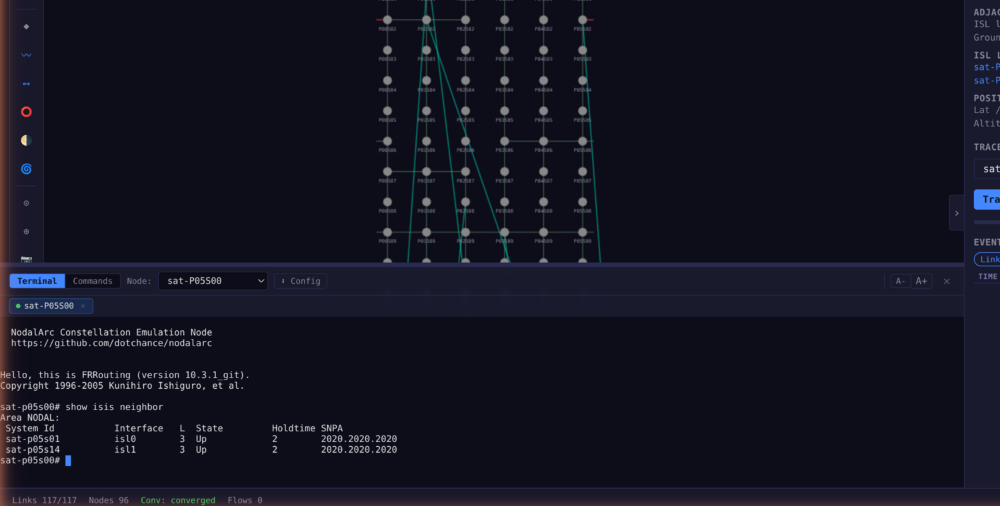
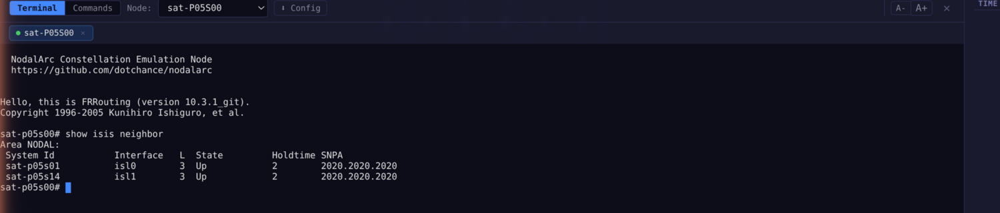

# NodalArc - Satellite Network Emulation for Orbital Routing

NodalArc is an orbital network emulator for testing real routing stacks against moving satellite topology.

It gives network engineers a lab where satellites move, links appear and disappear, ground exits change, and routers have to live inside that motion.



## What NodalArc Is

NodalArc is an emulator, not a packet-level simulator.

Each satellite and ground station becomes a real Linux network namespace running a real routing stack. IS-IS hellos, OSPF LSAs, BGP updates, MPLS labels, kernel interfaces, carrier transitions, VXLAN links, and `tc` shaping all happen in the system that Linux actually runs.

The orbital mechanics are not decoration around a static lab. They drive the lab. When two satellites move out of range, the interface drops. When a ground station hands off to a new satellite, the router sees the carrier event. When the distance between two endpoints changes, the link latency changes with it.

NodalArc is for testing questions like:

- What does IS-IS do when cross-plane links disappear at the polar seam?
- How much route churn does a ground-station handoff create?
- What happens when the same constellation runs under OSPF, IS-IS, SR-MPLS, or centralized path computation?
- How much of a measurement came from the protocol, and how much came from the lab substrate?
- When does distributed routing stop being the right model?

That is the point: give real routers a moving world and watch what they do.

## Why This Exists

Networks are leaving the ground.

That sounds like a slogan until you have to route through it. A terrestrial network lets you pretend the topology is mostly fixed. Links fail, routers reboot, fiber gets cut, but the bones of the thing stay where you put them.

On-orbit and space-based networks do not work that way.

A satellite in low Earth orbit is moving about seven and a half kilometers a second. A cross-plane link can exist now and be gone a few minutes later. A ground station can be the best exit from the network this pass, and useless on the next. On the ground, topology change is an event. In orbit, topology change is the medium you are swimming in.

NodalArc was built to make that difference measurable.

## Quick Start

The command line is for installation and operations. Once NodalArc is running, users work from the browser.

### Requirements

- Linux host: Ubuntu 22.04+ or Debian 12+
- Root access for host bootstrap
- Docker
- Kubernetes: K3s is installed by the bootstrap script if no cluster is present
- `kubectl`, Helm, Node.js 22, and `uv`
- 8 GB RAM minimum for the demo constellation
- 32 GB RAM recommended for larger constellations

### Install And Run

```bash
git clone https://github.com/dotchance/nodalarc.git
cd nodalarc
sudo scripts/bootstrap-host.sh
make all
```

`make all` builds the frontend, builds the service images, loads them into the cluster, installs the Helm chart, deploys the default session, and prints status.

When the platform is ready, open:

```text
http://localhost:3000
```

For a remote host, expose or forward port `3000` for the visualization frontend and port `8080` for VS-API.

## The Browser Is The Lab

NodalArc is built so a platform operator can install it, and a network engineer can run experiments from the GUI without touching `make`, `kubectl`, or shell scripts.

From the browser you can:

- choose constellations, satellite types, ground-station sets, and routing stacks
- preview coverage before deploying a bad session
- deploy and switch sessions
- watch satellites, ISLs, ground links, handoffs, and convergence events
- inspect individual satellites and ground stations
- trace paths between nodes
- open a terminal on a routing instance and run router commands

The browser is not a mock-up. It is connected to the running emulation.

## Visual Workflow

### 1. Watch The Moving Network

The globe shows satellites, ground stations, orbital paths, inter-satellite links, and ground links in motion. Link state follows the geometry.


### 2. Build Or Select A Session

The session wizard reads the same files the runtime reads. You can deploy from existing YAML, choose from catalog presets, or build a new session from primitives.



The important boundary is still the session. The wizard is a safer way to write it, not a second configuration system.



### 3. Preview The Geometry Before Deploy

The coverage preview runs feasibility math before pods come up. It shows which ground stations are reachable, where the gaps are, how ISLs form, and where the selected geometry is going to disappoint you.



The editor can tell you whether the YAML parses. The preview tells you whether the sky agrees.

### 4. Inspect The Running Network

Select a satellite or ground station to see active links, link latency, position, route-adjacency context, and trace controls.



Switch to the topology view when the orbital picture is too physical and you want the graph.



### 5. Open A Router Terminal

Every satellite and ground station is a routing instance. Open the terminal and run the commands you already know.



The terminal is not decorative. This is FRR running inside the emulated node.



## What You Can Test

Once the system is running, you can:

- watch IS-IS or OSPF reconverge as orbital links appear and disappear
- measure ground-station handoff impact instead of arguing about timers
- run the same constellation under IS-IS, OSPF, SR-MPLS, or NodalPath
- change altitude, inclination, plane count, phase offset, and satellite terminal models
- move ground stations and see what reachability you bought or lost
- run `ping`, `traceroute`, and `iperf` through the emulated constellation
- open a browser terminal to any satellite or ground station and use `vtysh`
- script experiments through the REST and WebSocket APIs
- connect external systems to the emulation and watch how they behave

Start small. Demo-36 is enough to see the machinery. Starlink-176 and Iridium-66 start to show why the geometry matters. A Walker Delta gives you a steady backbone and access handoffs. A Walker Star gives you global reach and a polar seam that tears through the backbone on schedule.

That is where the interesting questions start.

## What The System Gives You

### Real Routing Stacks

FRR gives you IS-IS, OSPF, BGP, SR-MPLS, LDP, and traffic engineering. The architecture is not built around FRR as the answer. FRR is the first practical router to put inside the moving world.

The same emulation boundary can host other containerized routers and external systems. The router lives inside the motion. NodalArc gives it the interfaces, carrier events, latency, bandwidth, and reachability the geometry allows.

### Real Kernel Networking

The Node Agent builds veth pairs and VXLAN tunnels, then shapes them with `tc netem` and `tc tbf`. Latency comes from range. Bandwidth comes from the terminal model. The lab has a substrate, and the substrate is measured.

### Session Primitives

NodalArc sessions are built from primitives:

- satellite types describe hardware: terminals, ranges, bandwidth, tracking limits
- constellation geometry describes where the satellites move
- ground stations describe where the network touches Earth and what prefixes enter there
- routing stacks describe what runs inside each node

Change one primitive and leave the others alone. Same sky, different routing. Same routing, different sky. Same constellation, different ground exits. A clean comparison has one deliberate difference.

### Time Control

Pause, resume, change speed, and seek. If a failure happens at a certain point in the orbit, move time there and inspect the state while the system is still.

### Multi-Node Scale

A single machine can run hundreds of nodes. A Kubernetes cluster can spread the emulation across machines. Local links use host-mediated veths. Cross-node links use VXLAN. Substrate latency compensation keeps the emulated delay tied to the orbital path, not to the physical lab network.

### NodalPath

NodalPath provides centralized path computation for experiments where distributed routing is not the model you want to test. If the future geometry is computable, forwarding state can be computed ahead of the topology instead of discovered one failure at a time.

## Architecture At A Glance

```text
OME          Orbital mechanics and visibility truth
Scheduler    Desired topology, reconciliation, and link intent
Node Agent   Host kernel operations and proof of actual state
Operator     Session lifecycle, pods, configs, and deployment
VS-API       Browser/API front door and state aggregation
VF           React + Three.js visualization frontend
NodalPath    Centralized path computation engine
NATS         Event bus and durable fact stream
```

The boundary matters. OME computes the sky. The Scheduler decides what should exist. The Node Agent proves what Linux actually did. The router owns routing.

## Project Structure

```text
services/       Backend services: OME, Scheduler, Node Agent, VS-API, Operator
frontend/       Visualization frontend: React + Three.js
nodalpath/      NodalPath path computation engine
lib/            Shared Python library
images/         Container images: FRR, probe, forwarding sidecar
deploy/         Helm chart and deployment tooling
configs/        Constellations, ground stations, satellite types, sessions
tests/          Unit and integration tests
docs/           User, operations, and developer documentation
tools/          Lifecycle and operational tooling
scripts/        Host bootstrap and infrastructure scripts
```

## Documentation

The docs are split by the work you are trying to do.

- [User Guide](docs/user/) - visualization, sessions, node inspection, path tracing, terminal access, and API use
- [Operations Guide](docs/ops/) - install, Kubernetes deployment, multi-node clusters, scaling, teardown, and troubleshooting
- [Developer Guide](docs/dev/) - architecture, invariants, services, tests, and contribution workflow

## Community

NodalArc is source-available and welcomes useful contributions. Bugs, routing stacks, constellation models, visualization improvements, documentation fixes, and operational reports all help, as long as they respect the architecture.

- **Issues** - bug reports, feature requests, and questions
- **Pull Requests** - read the [Developer Guide](docs/dev/) before opening one
- **Discussions** - architecture proposals, use cases, and experiments

## Repository Metadata

Recommended GitHub About description:

```text
Satellite network emulator for orbital routing, handoffs, and moving topology.
```

Recommended GitHub topics:

```text
networking satellite satcom emulation emulator routing orbital space leo kubernetes frr ospf isis bgp mpls segment-routing traffic-engineering linux-networking vxlan network-visualization
```

Recommended website:

```text
https://nodal.asmolab.net
```

Suggested social preview image:

```text
docs/images/github-social-preview.png
```

## License

NodalArc Source Available License 1.0. You can use, modify, and distribute it subject to the license terms. You cannot offer it as a hosted or managed service that provides access to a substantial set of NodalArc features. See [LICENSE](LICENSE) for full terms and [THIRD_PARTY_NOTICES.md](THIRD_PARTY_NOTICES.md) for bundled third-party notices.

Copyright 2024-2026 .chance (dotchance)
