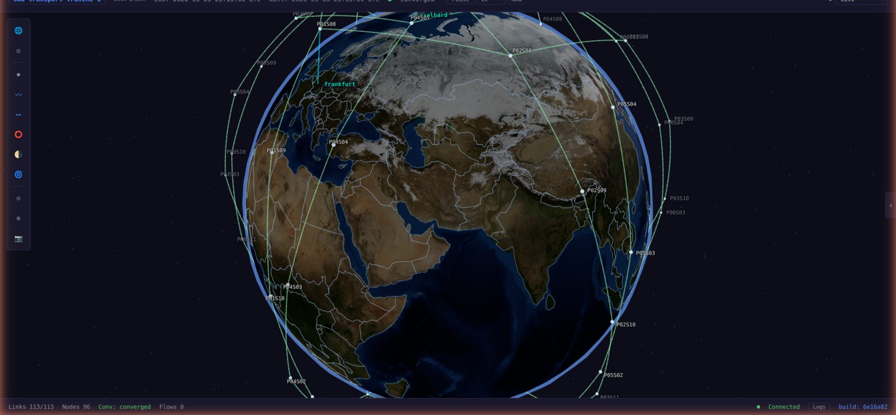

# NodalArc

**Orbital network emulation at scale.** Deploy real routing stacks on satellite constellation topologies driven by real orbital mechanics. Every satellite runs a real router. Every link is shaped by real physics. Every packet traverses real kernel interfaces.



## Why NodalArc Exists

Satellite mega-constellations are reshaping global communications infrastructure. Starlink, Kuiper, OneWeb, SDA Transport Layer — thousands of satellites forming dynamic mesh networks in low Earth orbit. The routing problems are unlike anything in terrestrial networking: topologies that change every second, links that appear and vanish as satellites move, latencies that shift continuously with orbital geometry, and ground station handoffs that force real-time reconvergence across hundreds of nodes.

You can't test this on real hardware — you'd need a thousand satellites. You can't test it in a simulator — simulators model protocol behavior, they don't execute it. They tell you "IS-IS should converge in 2 seconds." They can't tell you whether FRR's actual IS-IS implementation handles the specific sequence of interface state changes that happen during a polar ground station handoff at 7.5 km/s.

NodalArc is an emulation platform. Every satellite and ground station is a real Linux network namespace running a real FRRouting daemon. IS-IS hellos, OSPF LSAs, BGP updates, and MPLS label operations happen in the kernel — not in a model. When you exec into a satellite and run `show isis neighbor`, you're talking to the same code that runs on production routers. When a link goes down because a satellite moved out of range, FRR detects real carrier loss on a real interface and reconverges exactly as it would on physical hardware.

The result: you can measure what actually happens, not what a model predicts should happen.

## Quickstart

```bash
git clone https://github.com/nodalarc/nodalarc.git
cd nodalarc
sudo scripts/bootstrap-host.sh   # installs K3s, Docker, Helm, Node.js (skip if you have K8s)
make all                          # builds everything, deploys a 36-satellite OSPF constellation
```

Open **http://localhost:3000**. You're looking at 36 satellites orbiting Earth with OSPF routing, 6 ground stations, and live ISL links — all running real FRR daemons on real kernel interfaces. About 3 minutes from clone to running constellation.

## What You Can Do

- **Test routing convergence on dynamic topologies** — watch IS-IS/OSPF reconverge as links appear and disappear with orbital geometry
- **Measure ground station handoff impact** — see exactly how long traffic is disrupted when a satellite passes from one ground station's coverage to the next
- **Compare routing protocols at scale** — run the same 176-satellite constellation with IS-IS, OSPF, or SR-MPLS and compare convergence time, routing table size, and path optimality
- **Validate MPLS label stacks** — test segment routing and traffic engineering on topologies with hundreds of label-switched paths
- **Experiment with constellation design** — change altitude, inclination, plane count, satellite count, and see how routing behavior changes
- **Experiment with ground station placement** — move stations, change elevation masks, adjust tracking capacity, and observe the effect on network reachability
- **Run real traffic** — ping, traceroute, iperf across the emulated constellation. Real packets, real forwarding, real latency
- **Automate testing** — script everything through the REST/WebSocket API. Build CI pipelines that validate routing behavior on every commit
- **Access any router from the browser** — open an SSH terminal to any satellite or ground station, run vtysh commands, inspect routing state live

## Key Capabilities

### Real-Time 3D Visualization

A web-based globe view shows the full constellation orbiting Earth in real time. ISL links, ground connections, orbital paths, and satellite trails render at 60fps. Click any node to inspect its routing state. Watch links form and break as satellites move.

### Browser Terminal Access

Open a persistent SSH session to any satellite or ground station directly from the UI. You land in vtysh — the same CLI as a physical router. Run `show ip route`, `show isis neighbor`, `configure terminal`, or any FRR command. Multiple sessions stay alive in tabs.

### Session Wizard

Configure and launch constellation sessions from the browser. Pick a constellation geometry, satellite type, ground station set, and routing protocol. Deploy without touching the command line. Switch between sessions without teardown.

### Time Controls

Pause, resume, and adjust simulation speed. Seek to any point in the orbital period. Observe how routing state evolves at different time scales.

### Programmable API

Full REST and WebSocket access to all constellation state. Node positions, link metrics, routing tables, path traces, convergence events. Build custom dashboards, automated test harnesses, or integration scripts.

### Multi-Node Scaling

Single-node deployments handle 200+ satellites on a laptop. Multi-node clusters scale to thousands. Cross-node ISLs traverse VXLAN tunnels with substrate latency compensation — the emulated latency is always accurate regardless of physical network topology.

### Multiple Routing Stacks

IS-IS, OSPF, BGP, SR-MPLS, LDP, traffic engineering — any FRR-supported protocol combination. NodalPath provides centralized path computation for NEBULA-aligned architectures.

## Documentation

NodalArc documentation is organized by audience:

### [User Guide](docs/user/) — Using the visualization and simulation

For anyone interacting with NodalArc through the web interface. How to launch sessions, interpret the visualization, use the terminal, trace paths, and run experiments. No backend knowledge required.

### [Operations Guide](docs/ops/) — Deploying and maintaining NodalArc

For infrastructure engineers deploying NodalArc on Kubernetes clusters. Installation, configuration, multi-node setup, scaling, monitoring, and troubleshooting. You know K8s; this teaches you NodalArc.

### [Developer Guide](docs/dev/) — Contributing to NodalArc

For developers working on the NodalArc codebase. Architecture deep dives, component internals, development workflow, testing, code conventions, and extension points. Read this before opening a PR.

## Project Structure

```
services/       Backend services (OME, Scheduler, Node Agent, VS-API, Operator)
frontend/       Visualization frontend (React + Three.js)
nodalpath/      NodalPath path computation engine
lib/            Shared Python library
images/         Container images (FRR, probe, forwarding sidecar)
deploy/         Helm chart and deployment tooling
configs/        Constellations, ground stations, satellite types, sessions
tests/          Unit and integration tests
docs/           Documentation (user, ops, dev)
tools/          Operational tooling (teardown, scenario injection)
scripts/        Host bootstrap and infrastructure scripts
```

## Community

NodalArc is open source and welcomes contributions. Whether you're fixing a bug, adding a routing protocol, improving the visualization, or writing documentation — we want your help.

- **Issues** — bug reports, feature requests, questions
- **Pull Requests** — see the [Developer Guide](docs/dev/) for workflow and conventions
- **Discussions** — architecture proposals, use case ideas, integration questions

## License

NodalArc Source Available License 1.0. You can use, modify, and distribute it freely. You cannot offer it as a hosted service or build a competing commercial product from it. See [LICENSE](LICENSE) for full terms.

Copyright 2024-2026 .chance (dotchance)
