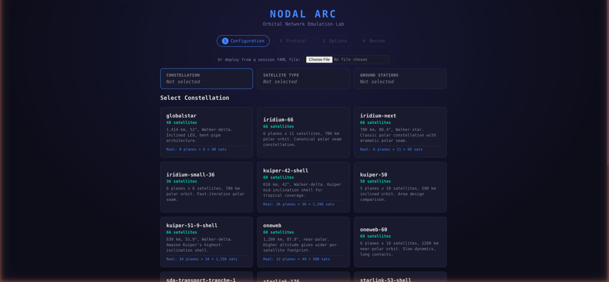

# Sessions

A session is a running constellation emulation. It defines which satellites are in orbit, how they're connected, which ground stations exist, and what routing protocol they're running. You can deploy different sessions to experiment with different configurations.

## Creating a Session from the Wizard

The session wizard walks you through building a constellation configuration step by step.

### Step 1: Choose a Constellation

The constellation defines the orbital geometry - how many satellites, at what altitude, in what pattern.

| Constellation | Satellites | Description |
|---------------|-----------|-------------|
| Demo-36 | 36 | Single orbital ring. Fast to deploy, good for learning |
| Starlink-176 | 176 | 16 orbital planes, realistic Starlink-scale topology |
| Starlink-576 | 576 | Full shell, large-scale testing |
| Iridium-66 | 66 | Polar orbit constellation |
| OneWeb-60 | 60 | Medium-altitude constellation |
| Kuiper-50 | 50 | Amazon Kuiper-inspired geometry |
| Custom | Any | Define your own orbital parameters |

Larger constellations take longer to deploy and require more system resources. Start with Demo-36 or Starlink-176 for evaluation.

### Step 2: Choose a Satellite Type

The satellite type defines what hardware each satellite carries - specifically its inter-satellite link (ISL) terminals and ground-facing antennas.

| Satellite Type | ISL Terminals | ISL Range | Description |
|---------------|--------------|-----------|-------------|
| Starlink V2 | 4 optical | 5,000 km | Standard optical laser ISL platform |
| Generic 4-ISL | 4 optical | 5,000 km | Generic satellite bus with 4 ISL terminals |
| Generic 2-ISL | 2 optical | 5,000 km | Minimal ISL configuration (intra-plane only) |
| Iridium NEXT | 4 RF | 4,400 km | RF crosslinks |
| Kuiper V1 | 4 optical | 5,000 km | Amazon Kuiper platform |

The ISL terminal count determines how many simultaneous inter-satellite links each satellite can maintain. A 4-terminal satellite typically has 2 intra-plane links (forward/backward in the same orbital ring) and 2 cross-plane links (to satellites in adjacent orbital planes).

### Step 3: Choose Ground Stations

Ground stations are where the constellation connects to terrestrial networks. You can choose a predefined set or pick individual stations.

| Ground Station Set | Stations | Coverage |
|-------------------|----------|----------|
| Demo | 6 | US + Europe + Asia (Hawthorne, Ashburn, Denver, Frankfurt, Singapore, Tokyo) |
| Global | 7 | 6 continents including McMurdo (Antarctica) |
| US CONUS | 4 | Continental US coverage |
| Transatlantic | 4 | US East Coast + Europe |
| Transpacific | 4 | US West Coast + Asia-Pacific |
| Polar Emphasis | 6 | High-latitude stations for polar orbit testing |

Each ground station has tracking antennas that connect to overhead satellites. When multiple satellites are visible, the system picks the best candidate based on elevation angle. Ground stations originate a default route into the routing protocol, so satellites with active ground connections become preferred gateways for internet-bound traffic.

### Step 4: Choose a Routing Protocol

The routing protocol runs inside every satellite and ground station, computing forwarding paths across the constellation.

| Protocol | Description | Best For |
|----------|-------------|----------|
| OSPF | Open Shortest Path First. Common in enterprise networks | Learning, small constellations, familiar protocol |
| IS-IS | Intermediate System to Intermediate System. Preferred for large networks | Large constellations, multi-area designs, production-like testing |
| IS-IS + TE | IS-IS with traffic engineering extensions | Traffic engineering, bandwidth-aware routing |
| IS-IS + SR-MPLS | IS-IS with segment routing over MPLS | Label-switched paths, service chaining |
| NodalPath | Centralized path computation (not distributed routing) | NEBULA-aligned architectures, PCE testing |

For your first session, OSPF or IS-IS with a flat area strategy is simplest. For larger constellations (100+ satellites), IS-IS with per-plane areas is recommended - it keeps the routing database manageable by limiting flooding scope to each orbital plane.

### Step 5: Deploy

Click Deploy. The system builds the constellation configuration, creates all satellite and ground station nodes, wires their network interfaces, and starts the routing protocol. Deployment takes 1-3 minutes depending on constellation size.

The visualization updates live during deployment - you'll see satellites appear as their pods come online.

## Switching Sessions

You can switch to a different session without restarting NodalArc. Open the session wizard and deploy a new configuration. The system tears down the current session and brings up the new one automatically. You'll see a progress indicator during the transition.

## What Each Setting Means

### Altitude

Higher altitude means longer orbital periods (satellites move more slowly relative to the ground), longer ISL ranges (satellites are farther apart), and higher ground-to-satellite latency. LEO constellations (500-1200 km) offer low latency but require many satellites for global coverage.

### Inclination

The orbital inclination determines the latitude range the constellation covers. A 53-degree inclination (like Starlink) covers latitudes from 53N to 53S. A 97-degree (sun-synchronous) orbit covers nearly pole-to-pole. Higher inclination means better polar coverage but potentially lower satellite density at the equator.

### Planes and Satellites Per Plane

More planes = wider longitude coverage with fewer satellites per plane. More satellites per plane = denser coverage within each orbital ring. The phase offset between planes determines the "stitching" pattern between adjacent planes and affects cross-plane ISL geometry.

### Area Strategy

For IS-IS and OSPF, the constellation is divided into routing areas to limit flooding scope:

- **Flat** - all nodes in one area. Simplest but every topology change floods everywhere
- **Per-plane** - each orbital plane is its own area. Recommended for large constellations
- **Stripe** - groups of adjacent planes share an area. Balance between scope and inter-area routing

### Minimum Elevation

The minimum elevation angle for ground station visibility (set per ground station). Higher values mean the ground station only connects when a satellite is nearly overhead - shorter connection windows but stronger signal. Lower values mean longer connections but at lower signal quality and higher slant range.

## Session Lifecycle

A session goes through these states:

1. **Creating** - pods are being deployed, FRR configs delivered
2. **Wiring** - network interfaces being connected, routing starting
3. **Ready** - all nodes running, routing converging
4. **Active** - routing converged, constellation fully operational

You can interact with the session at any point after it reaches Ready. Routing convergence typically takes 10-30 seconds after all interfaces are wired, depending on constellation size and protocol.
