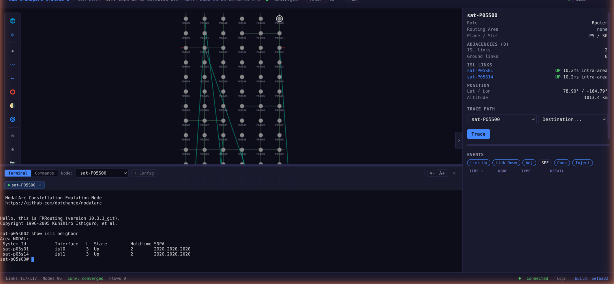

# Terminal Access

Every satellite, relay, and ground node in NodalArc runs a real FRRouting
daemon. You can open an interactive terminal to any node and run the same CLI
commands you would use on a physical router.

## Opening a Terminal from the Browser

1. Open the terminal panel (bottom of the screen, or press **]**)
2. Select a node from the dropdown
3. An interactive vtysh session opens as a tab

You land directly in the FRR CLI prompt:

```
space-sat-p00s00#
```

The exact prompt depends on the session namespace. In a multi-regime session
you may see nodes such as `leo-sat-p00s00`, `geo-sat-p00s02`, or
`lunar-site-gs-artemis-surface-router`.



### Multiple Sessions

Each node you select opens a new tab. Sessions persist when you switch between tabs - output accumulates in the background. Switch back and everything that happened while you were away is still there. This matches the standard network engineering workflow of having multiple SSH sessions open to different routers.

## Common Commands

### See routing neighbors

```
show isis neighbor          # IS-IS sessions
show ip ospf neighbor       # OSPF sessions
```

This shows which adjacent nodes have formed routing adjacencies. You will see
ISL neighbors, relay neighbors, and ground access neighbors when those links
are active and the routing protocol is scoped to that domain.

### View the routing table

```
show ip route
```

The full IP routing table. Routes learned via the IGP show the next-hop
interface and metric. Static routes appear when a session uses a protocol
boundary, such as a cislunar relay demo.

### Check a specific route

```
show ip route 10.255.1.1
```

Shows which interface and next-hop the router would use to reach a specific destination.

### View interface state

```
show interface brief
```

Lists all interfaces with their admin state and link state:

| Interface | What it connects to |
|-----------|-------------------|
| `isl0`, `isl1`, ... | ISL or relay interfaces assigned from the node's terminal inventory |
| `gnd0`, `gnd1`, ... | Ground access terminal interfaces, active when a compatible ground link is up |
| `lo` | Loopback (always UP, carries the node's stable address) |
| `terr0` | Terrestrial or local site network stub on ground nodes |
| `cni0` | Infrastructure interface (ignore - not a data path) |

Interfaces that are **UP** have active routing adjacencies. Interfaces that are **DOWN** or **LOWERLAYERDOWN** don't currently have a connected peer (the satellite hasn't formed that link yet, or the ground station connection hasn't been established).

### See the IS-IS database

```
show isis database detail
```

The full link-state database - every LSP (Link-State PDU) this router has received. This is how IS-IS knows about the entire network topology.

### MPLS label table (SR-MPLS sessions)

```
show mpls table
```

Shows the MPLS forwarding table with incoming labels, outgoing labels, and next-hop interfaces.

### View the running configuration

```
show running-config
```

The full FRR configuration for this node. Shows all enabled routing protocols, interface configurations, route-maps, and prefix-lists.

### Connectivity testing

```
ping 10.0.0.5
traceroute 10.255.1.1
```

Real ICMP ping and traceroute through the emulated network. Packets traverse
real kernel interfaces with real latency shaping. For long-delay links, such as
cislunar relay paths, use command-line timeout options; default ping or
traceroute settings may expire before the emulated path can respond.

## What You're Actually Seeing

When you run commands in the terminal, you're talking to a real FRRouting instance running inside a Linux container. The routing tables, adjacencies, and forwarding state are computed by the actual FRR code - the same code that runs on physical routers in production networks.

This means:

- **Routing convergence is real** - when a link goes down, IS-IS/OSPF detects it, floods the update, runs SPF, and installs new routes. The convergence time you observe is the real protocol implementation's convergence time.
- **Forwarding is real** - packets traverse real kernel interfaces with tc netem latency shaping. The latency you ping is the actual emulated propagation delay.
- **Configuration is real** - you can enter `configure terminal` and change FRR configuration. Add route-maps, change metrics, enable debugging. Changes take effect immediately, same as on hardware.

## Power User: Direct SSH

If you prefer a native SSH client (PuTTY, iTerm, SecureCRT), you can SSH directly to any node. See the [Operations Guide](../ops/operations.md) for SSH key setup and connection details.

## Tips

- Run `show isis neighbor` or `show ip ospf neighbor` repeatedly to watch adjacencies form and break as the constellation moves
- Compare routing tables on two adjacent satellites to understand how traffic flows between them
- On a ground node, run `show ip route` to see which prefixes are reachable and
  which protocol installed them
- Use `show interface brief` to see which terminal interfaces currently have
  carrier
