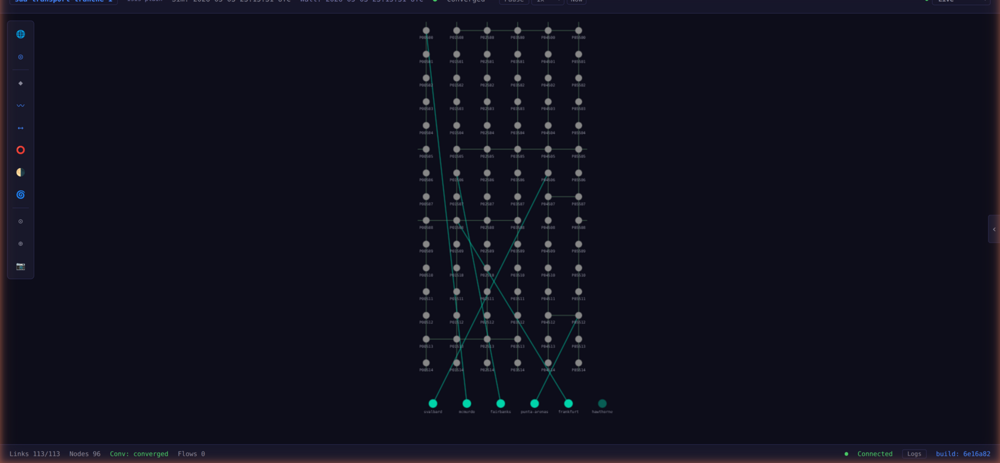

# Topology View

The topology view shows the constellation as a 2D network graph - nodes and links arranged spatially. This is the traditional "network diagram" perspective, complementing the 3D globe view.

Press **Tab** to switch between globe view and topology view.

## When to Use Topology View

The topology view is better than the globe for:

- **Understanding connectivity structure** - which nodes connect to which, how many hops between ground stations
- **Seeing routing adjacencies** - the graph layout shows the logical network, not physical orbital positions
- **Identifying routing areas** - area boundaries are visible in the node arrangement
- **Watching convergence** - link state changes are easier to track in 2D

The globe view is better for:

- **Understanding orbital geometry** - why links exist where they do
- **Watching ground station handoffs** - seeing which satellite is overhead
- **Appreciating the physical scale** - latency is distance, and the globe shows distance

## Layout

Satellites are arranged by orbital plane and slot. Ground stations are positioned at the bottom of the graph. Links are drawn between connected nodes.

The layout reflects the logical structure of the constellation - intra-plane links form horizontal chains, cross-plane links connect vertically between planes.

## Interactions

Navigation and selection work the same as in globe view:

- **Click** a node to select it and show details
- **Scroll** to zoom in/out
- **Drag** to pan the view
- **Escape** to deselect

The same keyboard shortcuts work in both views (L for links, G for ground links, color modes, etc.).

## Link Labels

In topology view, links can show latency labels - the current one-way propagation delay in milliseconds. As satellites move, these values update continuously reflecting the changing distance between connected nodes.
